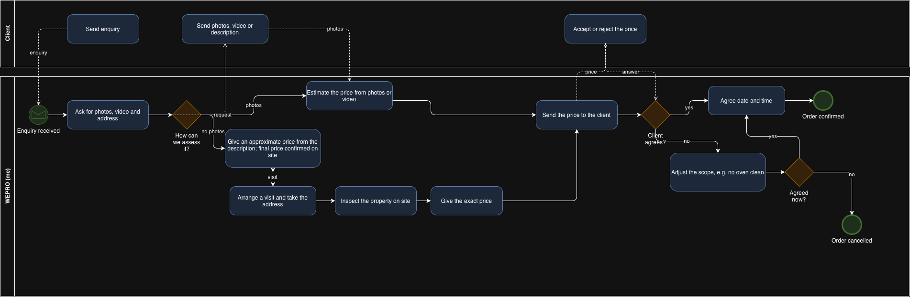
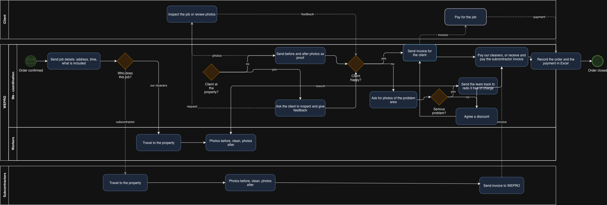

# BA portfolio — business process analysis

Process analysis of WEPRO, a cleaning and property services
company in Ireland, where I manage day-to-day operations.
## Note on the data
The order dataset used here is synthetic. It was generated to match the structure of a real order sheet — the same fields, the same services, a comparable number of orders. Any resemblance to real clients or figures is coincidental. The real data is confidential and is not published.
What this project shows is the method: how the process is modelled, how the data is structured, what questions are asked of it, and how the answers turn into findings and recommendations.

## Order to payment - as-is process (BPMN)

Modelled in BPMN with three participants: client, WEPRO and
subcontractors. Split into two diagrams.

### 1. Enquiry to confirmed order

### 2. Job delivery to payment

## What the map shows
- Most steps sit with one person, the coordinator — the process
  depends entirely on her availability
- Recurring clients skip four steps: no clarification, no estimate,
  no quote, no negotiation
- Quoting has three different paths depending on whether the client
  can send photos, and only the site visit gives a firm price
- Cleaners and subcontractors are paid only after the client has paid,
  so a late-paying client directly delays the people who did the work

## 2. Order analysis (Excel)
## Question
Where does the revenue actually come from - which clients, which services — and what does each type of work cost in coordination effort?

## Data
90 orders, January to August 2026. Fields: date, order ID, client, service, city, price, who carried out the job, payment status. A second sheet holds the client list with the client type (recurring or new).

## Method
Pivot tables for revenue by client, by month, by service and by client type
XLOOKUP to bring the client type from the client list into the order table
Column charts for the two comparisons that carry the findings

## Findings
1. Revenue is split almost evenly between recurring and new clients. Recurring €11,010 (52%), new €10,269 (48%), €21,279 in total.
2. Recurring clients bring more revenue from fewer jobs. Recurring: 41 orders, average €269. New: 49 orders, average €210 — 28% lower. On top of that, every new client goes through clarification, estimate, quote and negotiation; a recurring job skips all four steps.

3. The most frequent service is the least profitable one. Airbnb turnovers are the most common job (20 orders, 22% of all work) but bring only €2,007 - 9% of revenue, at an average of €100. After-renovation cleans are the opposite: 18 orders produce €7,810, 37% of revenue, at an average of €434.

## Recommendations
Try to turn new clients into regular ones. Regular clients pay more per job, and their jobs skip the whole quoting part, so each one takes less of my time. An easy way to test this: offer a repeat booking at the end of the first job.

Airbnb turnovers work better as a way in than as the main service. They are the most common job and the cheapest one. Two things worth trying: book them by area on the same day so there is less driving, and offer those clients deep cleans or after-renovation cleans, which pay about four times more.
## Limitations
The data does not say how long a job took or what it cost to do it, so I can only look at revenue, not profit.
Eight months is a short period. I cannot tell a real trend from normal seasonal ups and downs.
The client type is fixed in the data. I cannot see when a new client became a regular one, or whether that happened at all.

